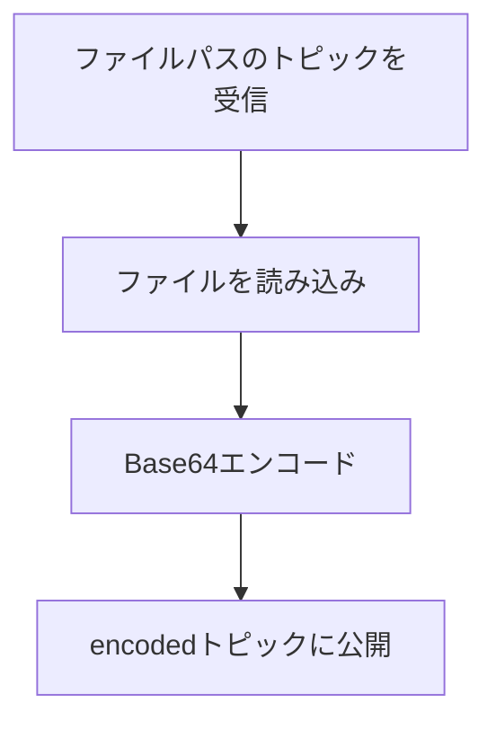

# base64_encoder
[](https://github.com/waarrk/base64_encoder/actions/workflows/test.yml)

ROS 2 ノード: ファイルパスのトピックを渡すと、ファイルをBase64エンコードして `encoded` トピックに公開するパッケージです

## Flow



## Build
```bash
source /opt/ros/humble/setup.bash
colcon build --packages-select base64_encoder
source install/setup.bash
```

## How to use
1. ノードを起動
   ```bash
   ros2 run base64_encoder base64-encoder-topic
   ```
2. 別ターミナルでファイルパスを publish
   ```bash
   source /opt/ros/humble/setup.bash
   source install/setup.bash
   ros2 topic pub --once /input_path std_msgs/String "{data: path/to/your/file.txt}"
   ```
3. 出力を確認
   ```bash
   ros2 topic echo /encoded --full-length
   ```

## 出力例
/encoded トピックに次のように出力されます
```plaintext
data: /9j/4AAQSkZJRgABAQEAkACQAAD/4QlWRXhpZgAATU0AKgAAAAgAAgESAAMAAAABAAEA....
```

出力例の全文は[ここ](/test/resources/encoded_b64.txt)にあります

## Test
GitHub Actionsで事前に用意されたJPGファイルをエンコードし、期待されるBase64文字列と比較しています

## Licence
BSD-3-Clause

## 謝辞
このパッケージのテストにはryuichiueda氏の
[Dockerイメージ](https://hub.docker.com/repository/docker/ryuichiueda/ubuntu22.04-ros2)を使用させていただきました